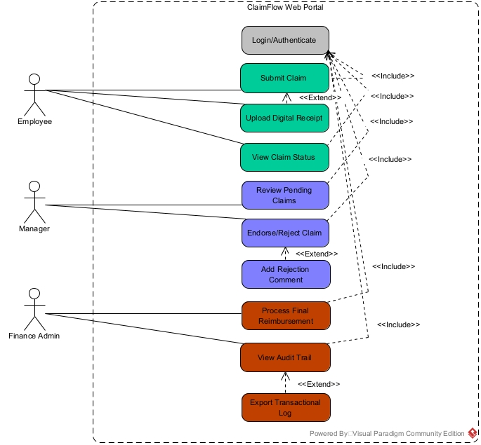

# ClaimFlow Web Portal
> A digital claims management application built for SMEs to replace receipt-by-WhatsApp with a proper approval workflow.

---

## Project Overview

This repository contains the full codebase and technical documentation for ClaimFlow, a full-stack web application developed as part of our diploma capstone project. ClaimFlow was built to solve a real operational problem: most SMEs manage employee expense claims through informal channels — receipt photos sent over WhatsApp, approvals tracked in someone's head, and finance teams spending hours chasing confirmations that should be automatic.

The application replaces that with a structured, role-based portal where claims are submitted digitally, routed through a defined approval workflow, and tracked from submission to reimbursement.

---

## The Team

| Name | Role | Responsibilities |
|---|---|---|
| **Ang Bi Jun** | Lead Frontend Engineer | Client-side state management, responsive UI/UX, and frontend-to-API integration |
| **Wong Sin Yaw** | Lead Backend Engineer | RESTful API development, server-side logic, and database integration  |
| **Travis Thio** | Lead Infrastructure Engineer | Azure cloud setup, environment configuration, database deployment, and DevSecOps planning |
| **Wong Lian Yi Daniel** | Lead QA & Technical Writer | Documentation, test case design, edge-case testing, and defect tracking |

---

## System Architecture

### Role-Based Access Control (RBAC)

ClaimFlow defines three user roles with non-overlapping permissions. Each role sees and does only what their position in the approval chain requires.

1. **Employee** — Submits expense claims, enters amounts, and uploads receipt images.
2. **Manager** — Reviews claims submitted within their department and either endorses or rejects them.
3. **Finance Admin** — Processes final disbursements and reviews the full audit history.

### Claim Lifecycle

Every claim moves through a fixed sequence of states:

```
Submitted → Pending Review → Endorsed / Rejected → Reimbursed
```

All actions taken by managers and finance admins are logged automatically, giving the organization a complete, tamper-proof record of every decision.

All system entry points require authentication. No claim data is accessible without a valid session.



---

## Database Schema

The database is structured around three tables linked by foreign keys. The design reflects the RBAC constraints directly — each table maps to a distinct part of the claim lifecycle.

---

### `users`
Stores credentials and role assignments for all system users.

| Column | Type | Description |
|---|---|---|
| `id` | `INT` | Primary key |
| `name` | `VARCHAR` | Full name |
| `email` | `VARCHAR` | Login email (unique) |
| `password_hash` | `VARCHAR` | Bcrypt-hashed password |
| `role` | `ENUM` | `Employee`, `Manager`, or `Finance Admin` |
| `department` | `VARCHAR` | Used to scope claim visibility for managers |
| `created_at` | `TIMESTAMP` | Account creation time |

---

### `claims`
Records each expense claim submitted by an employee.

| Column | Type | Description |
|---|---|---|
| `id` | `INT` | Primary key |
| `user_id` | `INT` | Foreign key → `users.id` |
| `amount` | `DECIMAL(10,2)` | Claimed expense amount |
| `category` | `VARCHAR` | Expense type (e.g. Transport, Medical, Software) |
| `expense_date` | `DATE` | Date the expense occurred |
| `receipt_url` | `VARCHAR` | Path to the uploaded receipt image in object storage |
| `status` | `ENUM` | `Submitted`, `Pending Review`, `Approved`, `Rejected`, `Reimbursed` |
| `created_at` | `TIMESTAMP` | Submission timestamp |
| `updated_at` | `TIMESTAMP` | Last status change timestamp |

---

### `audit_logs`
Records every status change made to a claim, with full context.

| Column | Type | Description |
|---|---|---|
| `id` | `INT` | Primary key |
| `claim_id` | `INT` | Foreign key → `claims.id` |
| `action` | `VARCHAR` | Action performed (e.g. `MANAGER_REJECTION`) |
| `performed_by` | `INT` | Foreign key → `users.id` |
| `old_status` | `ENUM` | Status before the change |
| `new_status` | `ENUM` | Status after the change |
| `remarks` | `TEXT` | Reason provided for approval or rejection |
| `created_at` | `TIMESTAMP` | Log entry timestamp |

---

## Testing & QA

Testing runs in parallel with development — not as an afterthought before submission. The QA plan covers two primary scenarios.

### Happy Path Testing
Verifies that valid, expected inputs produce the correct outcomes.

*Example:* An authenticated employee fills in a valid amount, attaches a JPEG receipt, and submits. The system returns a `201 Created` response and the claim status initializes to `Pending Review`.

### Edge Case Testing
Verifies that the system handles bad inputs gracefully — no crashes, no data corruption, clear error feedback.

- *Invalid input:* An employee enters a non-numeric value (letters, symbols, or a negative number) in the amount field.
- *Invalid file upload:* A user attempts to upload a corrupted file, an unsupported format, or an oversized image in place of a receipt.

---

## Getting Started

### Prerequisites
*(List required runtime versions here — e.g. Node.js v18+, PostgreSQL v15)*
- Requirement A
- Requirement B
- Requirement C

### Installation

```bash
# 1. Clone the repository
git clone https://github.com/thiozhaosheng/ClaimFlow.git

# 2. Navigate into the project directory
cd ClaimFlow

# 3. Install dependencies
npm install

# 4. Set up environment variables
cp .env.example .env

# 5. Start the development server
npm run dev
```
