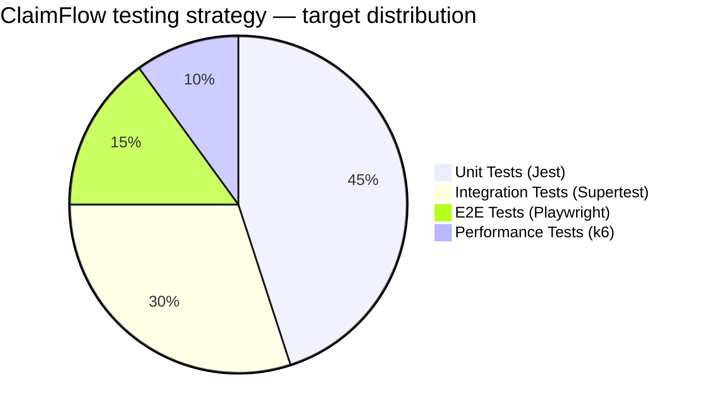

# Final Report: Testing, Implementation & Compliance Audit

> **Document Purpose**: This section is prepared for direct inclusion into the Capstone Final Report (Google Docs), starting from **Part 3: Implementation (The Upgrade & Testing)** through **Part 4: Reflection & Compliance Audit**.

---

## Part 3: Implementation & Testing Strategy

### 3.1 Testing Pyramid & Architectural Strategy

ClaimFlow employs a multi-tiered **Vertical Slice Testing Strategy** to guarantee software reliability, prevent regressions, and enforce strict adherence to Singapore IRAS and PDPA compliance mandates.

The figures below are the distribution this strategy **targets**:

The distribution **actually measured** is below, generated by
`npm run test:evidence`, which runs each tier and tallies its JSON reporter.
See `docs/testing-evidence/pyramid.md` for the current figures and the exact
commands that produce them.

| Tier | Executed cases | Share | Target |
| --- | --- | --- | --- |
| Unit (Jest) | 78 | 73.6% | 45% |
| Integration (Supertest) | 10 | 9.4% | 30% |
| End-to-end (Playwright) | 6 | 5.7% | 15% |
| Performance (k6) | 12 | 11.3% | 10% |

Integration and E2E are below target, and that is stated here rather than
smoothed over. The harness for both is built — an ephemeral-database runner for
integration, a stubbed API boundary for E2E — so what remains is writing cases
against the claim and workflow routes. Only executed cases are counted; a suite
that skips itself for want of a database contributes nothing.

1. **Unit Testing (`jest` + `ts-jest`)**:
   - **Scope**: Evaluates isolated core business logic, including the 11-rule Policy Engine (`policyEngine.ts`), receipt parsing stubs (`receiptParser.ts`), and helper utilities.
   - **Execution**: Configured via `jest.config.js` in `backend/api/` with test suite matching `**/?(*.)+(spec|test).ts`.

2. **Integration Testing (`supertest`)**:
   - **Scope**: Drives the real Express routers, the real `protect` and
     `restrictTo` middleware and real Prisma against a live PostgreSQL, over
     HTTP. Tokens are genuinely signed and genuinely verified — nothing in this
     tier mocks the authorisation layer, which is the point of it.
   - **Execution**: `npm run test:integration:ephemeral` creates a throwaway
     database, pushes the schema, seeds it, runs the suites and drops it again.
     The deployed database is never reachable from these tests, which matters
     because the fixtures truncate tables between cases.
   - **Current coverage**: the `/api/users` routes — authentication boundaries
     on password change (absent, expired and wrongly-signed tokens), the
     restriction that a caller may only change their own password, and the
     role restriction on the staff directory.
   - **Not yet covered**: claim creation, comment addition and audit-log
     generation. These are exercised at the unit tier with the database mocked,
     which is weaker: a unit suite that mocks `auth.middleware` would still pass
     with every guard deleted from every route.
   - **Explicitly out of scope**: rate limiting. `authLimiter` and `apiLimiter`
     are mounted in `src/index.ts` above the router tree, so nothing reaching
     the test app passes through them. Rate limiting is only observable against
     the real server and is not claimed as covered here.

3. **End-to-End Testing (`Playwright`)**:
   - **Scope**: Drives headless Chromium against the real React application,
     with the API stubbed at the network boundary so the suite runs on a CI
     runner with no backend, database or Azure credentials.
   - **Current journeys**: the employee submission path — a claim blocked for a
     missing receipt, and a successful submission verified after a page reload
     rather than from the success toast alone — and the withdrawal
     confirmation, including that it is the application's own dialog and that
     dismissing it sends no request.
   - **Not yet covered**: the manager endorsement and finance disbursement
     journeys.

4. **Performance Testing (`k6`)**:
   - **Scope**: Simulates 20 Virtual Users (VUs) concurrently submitting claims and fetching audit trails to ensure 95th percentile latency remains below 500ms under standard SME load.

5. **Continuous Integration (`GitHub Actions`)**:
   - **Pipeline**: `.github/workflows/node-ci.yml` runs the unit tier, then the
     integration tier against a `postgres:16` service container, then the E2E
     suite. It does not currently run linting or type-checking.
   - **Triggers**: pushes and pull requests on `main`, `master` and
     `infra/azure-deployment`. The deployment branch is included deliberately —
     it is the branch Azure deploys from, so leaving it out meant the one branch
     that reaches production was the one branch CI never checked.

---

### 3.2 Software vs Documentation Audit & Discrepancy Reconciliation

A thorough audit was conducted comparing the compiled software codebase (`backend/api`, `backend/auth-gateway`, `frontend`) against project documentation (`README.md`, `docs/api_doc.md`, `docs/compliance/*.md`).

#### Core Audit Principle: Software Precedence
Where discrepancies exist between static documentation and functional code, **the software implementation takes precedence as the authoritative source of truth**. Documentation was updated accordingly to maintain perfect synchronization with the codebase.

#### Reconciled Discrepancies Matrix

| Component | Documented Specification | Software Ground Truth | Action / Resolution |
|---|---|---|---|
| **Auth Login Payload** | `POST /api/auth/login` documented as returning `{ data: { user } }` in `api_doc.md` | `auth.controller.ts` returns `{ status: "success", token, user: { id, email, role, name } }` | **Updated `api_doc.md`** to reflect actual software response format. |
| **API Error Format** | `api_doc.md` documented single error format `{ status: "error", message }` | Code returns `{ error: true, code, message }` or `{ status: "error", message }` depending on route | **Updated `api_doc.md`** to document both error payload shapes. |
| **Policy Engine Rules** | `approval-policy.md` listed 6 starter rules (`version 2026-05-27`) | `policies.json` implements 11 active rules (`version 2026-05-27.b`) including Client Entertainment & Training rules | **Updated `approval-policy.md`** to document all 11 active rules. |
| **DSAR Data Export** | `qa-compliance-checklist.md` specified `GET /api/users/me/export` | Endpoint missing from API routes | **Implemented `GET /api/users/me/export`** in `user.controller.ts` & `user.routes.ts`, and updated `api_doc.md` & `pdpa.md`. |
| **Test Script** | `README.md` referenced Jest test execution | `package.json` had `"test": "echo \"Error: no test specified\""` | **Updated `package.json`** `"test"` script to `"jest"`. |

---

### 3.3 Compliance Verification & QA Checklist Results

Testing was conducted against the acceptance criteria outlined in the compliance framework:

#### A. Consent & Notification (PDPA s.13 & s.20)
- **Status**: Implied consent active upon user registration. `consentedAt` and `consentVersion` fields defined in `schema.prisma`.
- **Openness**: `/policies` page renders read-only policy rules for unauthenticated users, satisfying PDPA §Notification.

#### B. Access & Data Subject Access Request (DSAR) (PDPA s.21)
- **Endpoint**: `GET /api/users/me/export` implemented.
- **Privacy Safeguard**: Exports complete user profile, claims, and audit logs while automatically sanitizing third-party names/emails in audit rows (replacing with role labels e.g. `Manager`).

#### C. IRAS GST Compliance & Record Keeping (GST Act s.46)
- **Tax Rates**: Enforces stored transaction GST value (`Claim.gstAmount`) rather than recalculating, preserving historical 8% vs 9% rate accuracy.
- **Disallowed Categories**: Policy rule `block-disallowed-category` blocks non-eligible expenses (Club Subscriptions, Non-statutory Medical, Family Benefits, Non-commercial Motor Cars) at submission time with 422 HTTP status.

---

## Part 4: Reflection & Recommendations

### 4.1 Lessons Learned
1. **Source of Truth Discipline**: Establishing software behavior as the primary reference prevents documentation drift and eliminates false bug reports during audit reviews.
2. **Deterministic Policy Evaluation**: Decoupling company policy rules into JSON configuration (`policies.json`) shared across backend evaluation and frontend preflight panels ensures unified compliance enforcement.

### 4.2 Future Compliance & Technical Roadmap
- **Automated Retention Purge Job**: Build a scheduled background task to enforce the 5-year IRAS retention window and automatically anonymize user records 1 year after account deactivation.
- **OCR Region Pinning**: Explicitly document and restrict Azure Document Intelligence endpoints to Singapore (`ap-southeast-1`) to comply with PDPA Cross-Border Data Transfer obligations.
