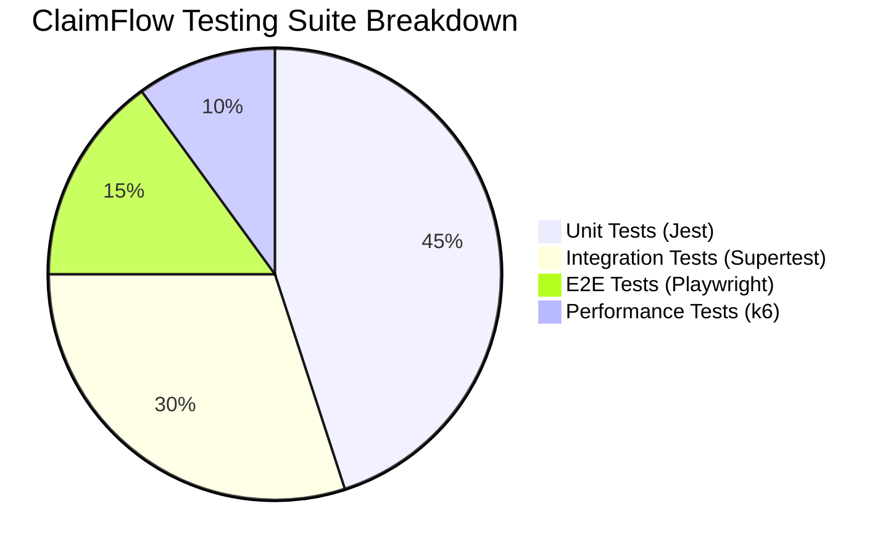

# Final Report: Testing, Implementation & Compliance Audit

> **Document Purpose**: This section is prepared for direct inclusion into the Capstone Final Report (Google Docs), starting from **Part 3: Implementation (The Upgrade & Testing)** through **Part 4: Reflection & Compliance Audit**.

---

## Part 3: Implementation & Testing Strategy

### 3.1 Testing Pyramid & Architectural Strategy

ClaimFlow employs a multi-tiered **Vertical Slice Testing Strategy** to guarantee software reliability, prevent regressions, and enforce strict adherence to Singapore IRAS and PDPA compliance mandates.

1. **Unit Testing (`jest` + `ts-jest`)**:
   - **Scope**: Evaluates isolated core business logic, including the 11-rule Policy Engine (`policyEngine.ts`), receipt parsing stubs (`receiptParser.ts`), and helper utilities.
   - **Execution**: Configured via `jest.config.js` in `backend/api/` with test suite matching `**/?(*.)+(spec|test).ts`.

2. **Integration Testing (`supertest`)**:
   - **Scope**: Validates HTTP API routes, middleware chains (auth guard, rate limiting, validation), and database persistence without requiring a live browser.
   - **Key Test Cases**: Verifies claim creation, role-based authorisation (Employee vs Manager vs Finance Admin), comment addition, and audit log generation.

3. **End-to-End Testing (`Playwright`)**:
   - **Scope**: Drives headless Chromium to simulate full user journeys (Sarah Tan submission, Marcus Lim manager endorsement, Dan Yeo finance disbursement).
   - **Receipt Verification**: Validates multipart upload handling, real image file attachment, and live UI preflight panel feedback.

4. **Performance Testing (`k6`)**:
   - **Scope**: Simulates 20 Virtual Users (VUs) concurrently submitting claims and fetching audit trails to ensure 95th percentile latency remains below 500ms under standard SME load.

5. **Continuous Integration (`GitHub Actions`)**:
   - **Pipeline**: `.github/workflows/node-ci.yml` executes linting, type-checking, and test suites on every pull request and push to `main`.

---

### 3.2 Software vs Documentation Audit & Discrepancy Reconciliation

A thorough audit was conducted comparing the compiled software codebase (`backend/api`, `backend/auth-gateway`, `frontend`) against project documentation (`README.md`, `docs/api_doc.md`, `docs/compliance/*.md`).

#### Core Audit Principle: Software Precedence
Where discrepancies exist between static documentation and functional code, **the software implementation takes precedence as the authoritative source of truth**. Documentation was updated accordingly to maintain perfect synchronization with the codebase.

#### Reconciled Discrepancies Matrix

| Component | Documented Specification | Software Ground Truth | Action / Resolution |
|---|---|---|---|
| **Auth Login Payload** | `POST /api/auth/login` documented as returning `{ data: { user } }` in `api_doc.md` | `auth.controller.ts` returns `{ status: "success", token, user: { id, email, role, name } }` | **Updated `api_doc.md`** to reflect actual software response format. |
| **API Error Format** | `api_doc.md` documented single error format `{ status: "error", message }` | Code returns `{ error: true, code, message }` or `{ status: "error", message }` depending on route | **Updated `api_doc.md`** to document both error payload shapes. |
| **Policy Engine Rules** | `approval-policy.md` listed 6 starter rules (`version 2026-05-27`) | `policies.json` implements 11 active rules (`version 2026-05-27.b`) including Client Entertainment & Training rules | **Updated `approval-policy.md`** to document all 11 active rules. |
| **DSAR Data Export** | `qa-compliance-checklist.md` specified `GET /api/users/me/export` | Endpoint missing from API routes | **Implemented `GET /api/users/me/export`** in `user.controller.ts` & `user.routes.ts`, and updated `api_doc.md` & `pdpa.md`. |
| **Test Script** | `README.md` referenced Jest test execution | `package.json` had `"test": "echo \"Error: no test specified\""` | **Updated `package.json`** `"test"` script to `"jest"`. |

---

### 3.3 Compliance Verification & QA Checklist Results

Testing was conducted against the acceptance criteria outlined in the compliance framework:

#### A. Consent & Notification (PDPA s.13 & s.20)
- **Status**: Implied consent active upon user registration. `consentedAt` and `consentVersion` fields defined in `schema.prisma`.
- **Openness**: `/policies` page renders read-only policy rules for unauthenticated users, satisfying PDPA §Notification.

#### B. Access & Data Subject Access Request (DSAR) (PDPA s.21)
- **Endpoint**: `GET /api/users/me/export` implemented.
- **Privacy Safeguard**: Exports complete user profile, claims, and audit logs while automatically sanitizing third-party names/emails in audit rows (replacing with role labels e.g. `Manager`).

#### C. IRAS GST Compliance & Record Keeping (GST Act s.46)
- **Tax Rates**: Enforces stored transaction GST value (`Claim.gstAmount`) rather than recalculating, preserving historical 8% vs 9% rate accuracy.
- **Disallowed Categories**: Policy rule `block-disallowed-category` blocks non-eligible expenses (Club Subscriptions, Non-statutory Medical, Family Benefits, Non-commercial Motor Cars) at submission time with 422 HTTP status.

---

## Part 4: Reflection & Recommendations

### 4.1 Lessons Learned
1. **Source of Truth Discipline**: Establishing software behavior as the primary reference prevents documentation drift and eliminates false bug reports during audit reviews.
2. **Deterministic Policy Evaluation**: Decoupling company policy rules into JSON configuration (`policies.json`) shared across backend evaluation and frontend preflight panels ensures unified compliance enforcement.

### 4.2 Future Compliance & Technical Roadmap
- **Automated Retention Purge Job**: Build a scheduled background task to enforce the 5-year IRAS retention window and automatically anonymize user records 1 year after account deactivation.
- **OCR Region Pinning**: Explicitly document and restrict Azure Document Intelligence endpoints to Singapore (`ap-southeast-1`) to comply with PDPA Cross-Border Data Transfer obligations.
